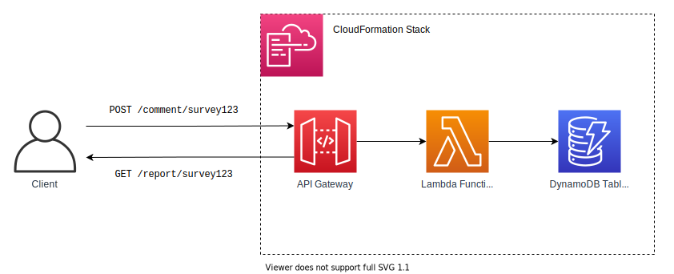

# Comment Vibe API (Culture Amp SRE Technical Interview Code)

> Welcome to the Culture Amp SRE Technical Interview code repository. This simple API and deployment IAC is the material we use to collaborate on with interviewees.

The Comment Vibe API is a small microservice for calculating sentiment using [AFINN-165](https://www.npmjs.com/package/sentiment) for comments left on surveys.

It exposes an API using API Gateway V2 and AWS Lambda and persists survey comments in a DynamoDB table. The infrastructure is managed and deployed using the AWS CDK



```
sre-tech-interview
├── ops                  AWS CDK project for deploying Comment Vibe
├── src                  Node.js application source code for Comment Vibe
├── Dockerfile           Builds AWS Lambda container image for Comment Vibe
├── docker-compose.yaml  Allows for Comment Vibe to be run locally for testing
├── openapi.yaml         OpenAPI documentation for Comment Vibe
└── readme.md            This document
```

## The API

Comment Vibe exposes two endpoints for use. See the [OpenAPI](./openapi.yaml) specification for more complete details.

### Comment on a survey : `POST /comment/:surveyId`

- Receives `surveyId` as parameter in path
- Receives new comment as JSON in the request body of a `POST` request
- Calculates `sentiment` field for the comment and saves it into the DynamoDB table
- Returns the comment with `sentiment` field set

### Reporting on a survey: `GET /report/:surveyId`

- Receives `surveyId` as parameter in path
- Queries DynamoDB for all comments for the given `surveyId`
- Buckets them based on `sentiment` and returns a basic report of the survey comments

## Setting up locally

Requirements
- AWS CLI
- Node
- `yarn`
- Docker


Running locally

```bash
yarn install
DYNAMODB_TABLE_NAME=MyDevelopmentTable node src/local.js
```

## Running local

```
IS_LOCAL=true yarn start
```

## Issues Introduced

- DynamoDB table name is hardcoded -- if engineer wanted to set up multiple environments this would be a problem

## DynamoDB Local

Start up local DynamoDB Local container with:

```
docker compose up -d
```

Create table within DynamoDB Local with:

```sh
❯ aws dynamodb --endpoint http://localhost:8000 create-table --cli-input-json '
{
  "TableName":"comment-vibe",
  "AttributeDefinitions":[
    {
      "AttributeName":"surveyId",
      "AttributeType":"S"
    },
    {
      "AttributeName":"datetime",
      "AttributeType":"S"
    }
  ],
  "KeySchema":[
    {
      "AttributeName":"surveyId",
      "KeyType":"HASH"
    },
    {
      "AttributeName":"datetime",
      "KeyType":"RANGE"
    }
  ],
  "BillingMode":"PAY_PER_REQUEST"
}'

# example response
{
    "TableDescription": {
        "AttributeDefinitions": [
            {
                "AttributeName": "surveyId",
                "AttributeType": "S"
            },
            {
                "AttributeName": "datetime",
                "AttributeType": "S"
            }
        ],
        "TableName": "comment-vibe",
        "KeySchema": [
            {
                "AttributeName": "surveyId",
                "KeyType": "HASH"
            },
            {
                "AttributeName": "datetime",
                "KeyType": "RANGE"
            }
        ],
        "TableStatus": "ACTIVE",
        "CreationDateTime": "2022-09-02T15:11:23.509000+10:00",
        "ProvisionedThroughput": {
            "LastIncreaseDateTime": "1970-01-01T10:00:00+10:00",
            "LastDecreaseDateTime": "1970-01-01T10:00:00+10:00",
            "NumberOfDecreasesToday": 0,
            "ReadCapacityUnits": 0,
            "WriteCapacityUnits": 0
        },
        "TableSizeBytes": 0,
        "ItemCount": 0,
        "TableArn": "arn:aws:dynamodb:ddblocal:000000000000:table/comment-vibe",
        "BillingModeSummary": {
            "BillingMode": "PAY_PER_REQUEST",
            "LastUpdateToPayPerRequestDateTime": "2022-09-02T15:11:23.509000+10:00"
        }
    }
}
```